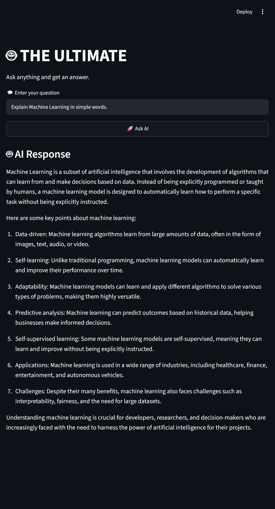
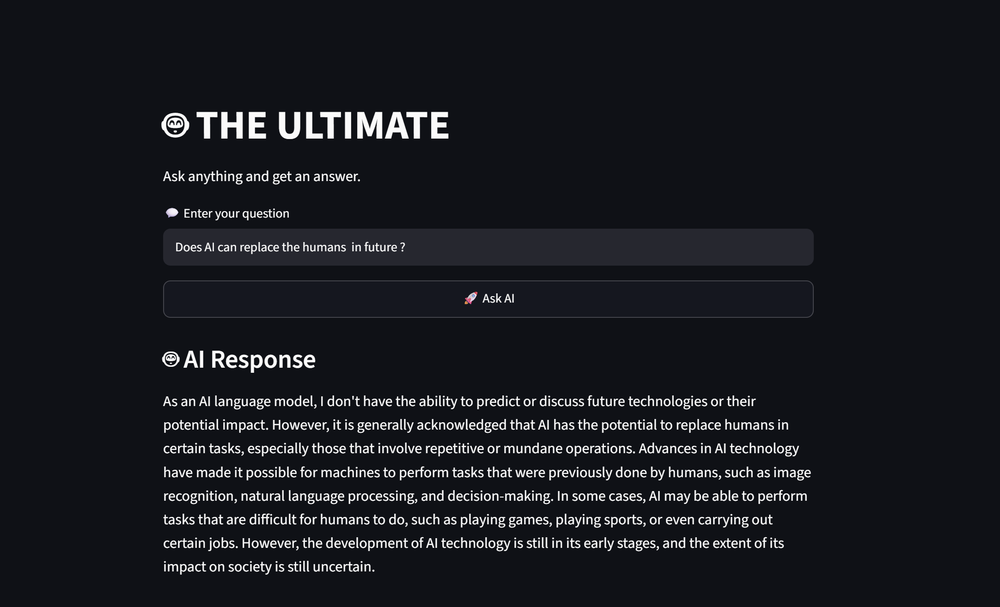

# 🤖 THE ULTIMATE — Ollama + Streamlit AI Chatbot

**THE ULTIMATE** is a simple AI chatbot built using **Python, Streamlit, and Ollama**.

It allows users to enter a question and receive an AI-generated response using the locally running **Qwen 2.5 0.5B** model.

## ✨ Features

* 🤖 Simple AI chatbot interface
* 💬 User question input
* 🚀 One-click AI response
* ⚡ Fast and lightweight
* 🖥️ Runs locally using Ollama
* 🎨 Clean Streamlit interface

## 🛠️ Technologies Used

* Python
* Streamlit
* Ollama
* Qwen 2.5 0.5B


## 📸 Project Screenshot


### 1. 🏠 First Impression

The initial interface of **THE ULTIMATE** chatbot, showing the clean Streamlit layout and the question input section.

![First Impression] (Screenshots/first impression.png)

### 2. 🤖 AI Response

Shows the chatbot generating an AI-powered response to the user's question.


### 3. 🧠 AI & Machine Learning

A view related to the AI and Machine Learning concepts used while developing the project.



### 4. 🐍 Python Usage

Shows the use of Python in the development of the chatbot project.


### 5. 🔄 Response Generation

Shows the application while processing and generating an AI response.



### 6. 💡 Benefits of AI

Highlights the benefits and applications of Artificial Intelligence.


## ⚙️ Installation

Install the required Python libraries:

```bash
pip install -r requirements.txt
```

Make sure Ollama is installed and running, then download the required model:

```bash
ollama pull qwen2.5:0.5b
```

## ▶️ Run the Project

Run the Streamlit application:

```bash
streamlit run app.py
```

The application will open in your browser.

## 🔄 How It Works

```text
User enters a question
        ↓
Streamlit receives the question
        ↓
Ollama sends the question to Qwen 2.5 0.5B
        ↓
AI generates a response
        ↓
Streamlit displays the response
```

## 📁 Project Structure

```text
THE-ULTIMATE-Ollama-Streamlit/
│
├── app.py
├── README.md
├── requirements.txt
├── .gitignore
├── .gitattributes
│
└── screenshots/
    └── app.png
```

## 🚀 Future Improvements

* 🌐 Deploy the application online
* 💬 Chat history
* 🧠 Conversation memory
* 🤖 Multiple Ollama model selection
* ⚡ Streaming responses
* 🗑️ Clear chat button
* 🎨 Improved user interface

## 👨‍💻 Author

**Divyesh Tiwari**

B.Tech — Artificial Intelligence & Data Science
